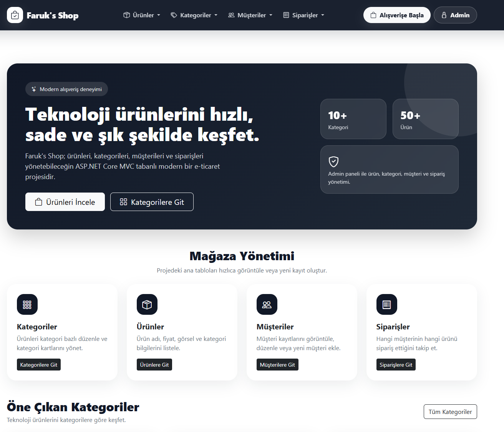
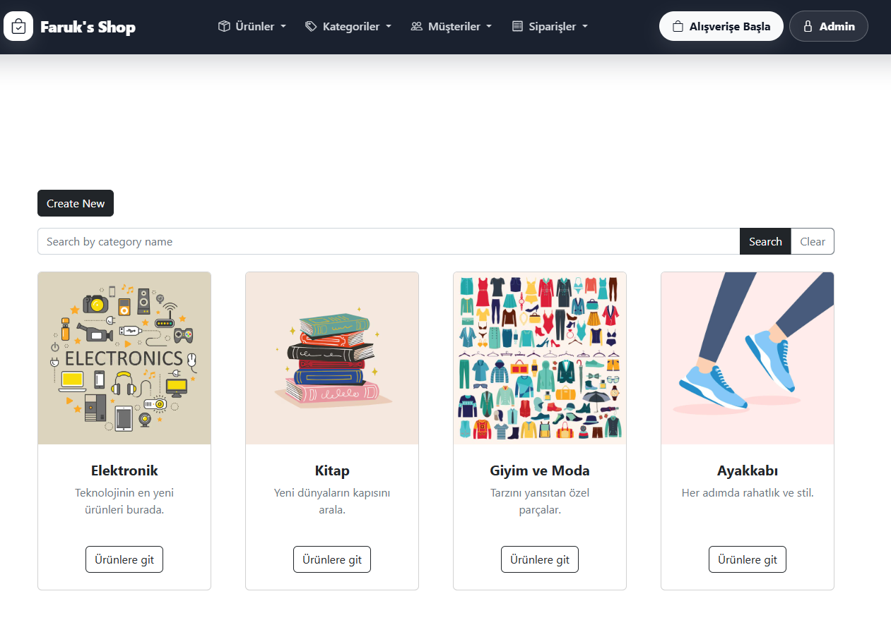
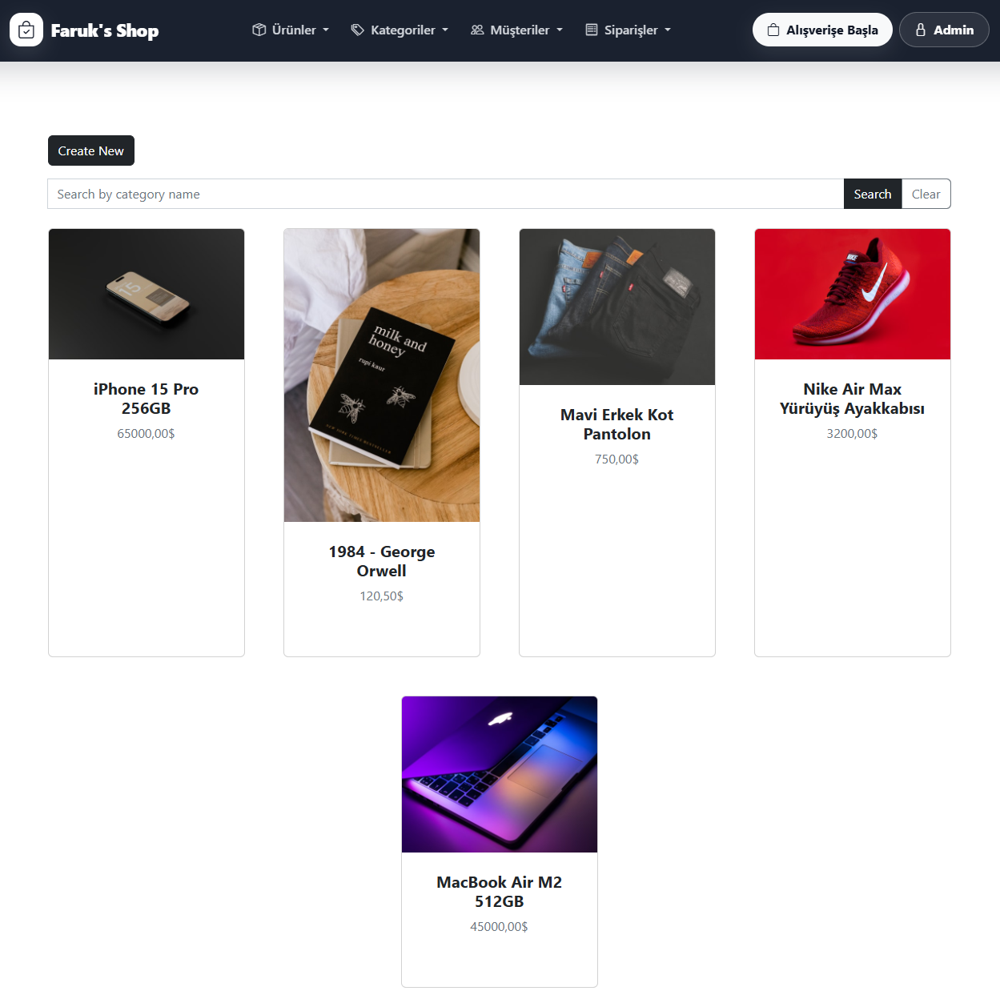
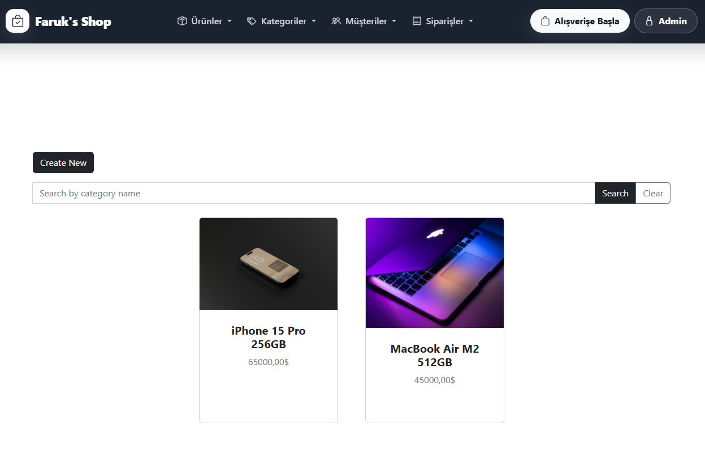
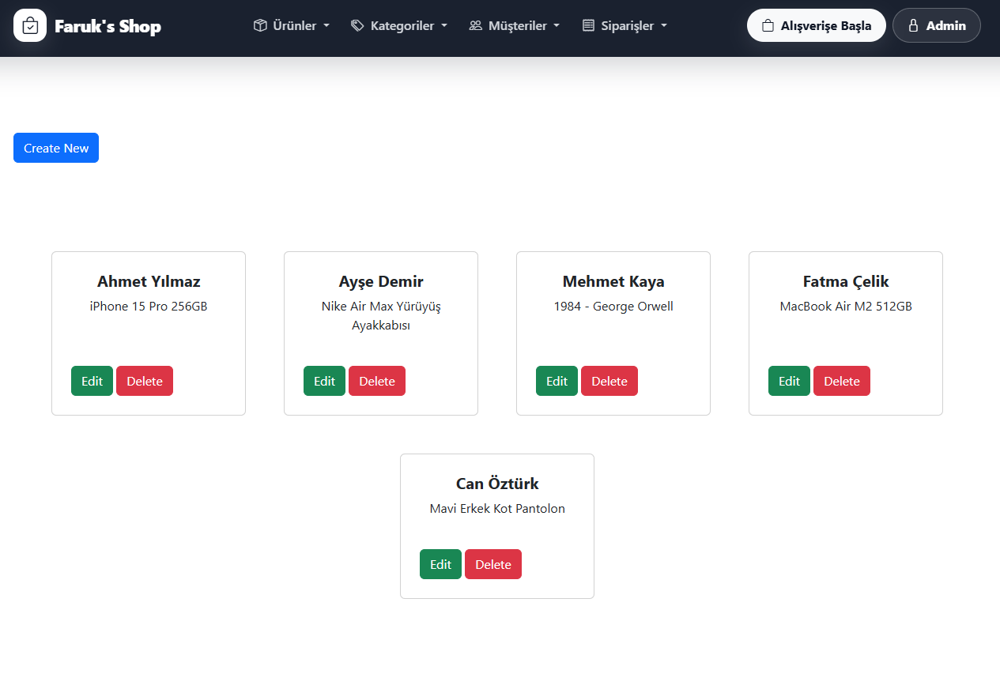
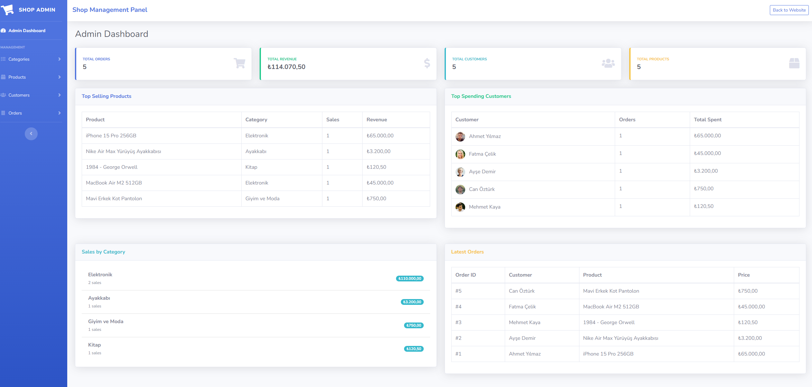

# Project.Shop

Project.Shop, **.NET 10** mimarisi kullanılarak geliştirilmiş, **ASP.NET Core MVC** tabanlı modern bir web uygulamasıdır. Projede veri erişim katmanı olarak **Entity Framework Core 10** ve veritabanı olarak **SQL Server** kullanılmaktadır.

## 🚀 Teknolojiler ve Araçlar

* **Framework:** .NET 10.0 (ASP.NET Core MVC)
* **ORM:** Entity Framework Core (v10.0.9)
* **Veritabanı:** Microsoft SQL Server
* **Mimari:** Model-View-Controller (MVC)

## 📁 Proje Yapısı

Proje temel MVC yapısına uygun olarak dizayn edilmiştir:

* **Controllers:** Gelen HTTP isteklerini karşılayan ve iş mantığına yönlendiren denetleyiciler.
* **Models:** Veritabanı tablolarını temsil eden entity sınıfları ve veri taşıma objeleri (DTOs).
* **Views:** Kullanıcıya sunulan arayüz (UI) sayfaları (Razor sayfaları - `.cshtml`).
* **Migrations:** Veritabanı şemasında yapılan değişikliklerin (Code-First yaklaşımı ile) versiyonlandığı klasör.
* **wwwroot:** CSS, JavaScript, görseller gibi statik dosyaların bulunduğu dizin.

## 🛠️ Kurulum ve Çalıştırma

Projeyi yerel ortamınızda çalıştırmak için aşağıdaki adımları izleyebilirsiniz:

1. **Gereksinimler:**
   * [.NET 10.0 SDK](https://dotnet.microsoft.com/download) sisteminizde kurulu olmalıdır.
   * SQL Server (LocalDB veya standart sürüm) çalışır durumda olmalıdır.

2. **Bağlantı Dizesi (Connection String) Ayarları:**
   * `appsettings.json` dosyasını açarak `ConnectionStrings` altındaki veritabanı bağlantı yolunun (SQL Server instance) kendi sisteminize uygun olduğundan emin olun.

3. **Veritabanının Oluşturulması (Migration İşlemleri):**
   * Package Manager Console (PMC) üzerinden:
     ```powershell
     Update-Database
     ```
   * Veya .NET CLI kullanarak:
     ```bash
     dotnet ef database update
     ```

4. **Uygulamayı Başlatma:**
   * Visual Studio kullanıyorsanız `F5` veya `Ctrl+F5` ile projeyi çalıştırabilirsiniz.
   * Terminal üzerinden çalıştırmak için ana dizinde:
     ```bash
     dotnet run
     ```

## 📝 Gelecekte Eklenebilecek Geliştirmeler

* Kimlik doğrulama ve yetkilendirme (Identity) entegrasyonu.
* Ödeme sistemleri (Payment Gateway) entegrasyonu.
* Yönetim paneli (Admin Dashboard) oluşturulması.
* Sepet ve sipariş yönetimi modüllerinin geliştirilmesi.

## 📄 Lisans

Bu proje eğitim ve kişisel gelişim amaçlı (SoftIto) oluşturulmuştur.

## 📸 Ekran Görüntüleri (Screenshots)

E-ticaret sisteminin kullanıcı arayüzüne ve yönetim paneline ait ekran görüntülerine aşağıdan ulaşabilirsiniz:

### 🌐 Ana Sayfa


---

### 🛍️ Ürün ve Kategori Gösterimi
Sistemde yer alan kategorilerin ve bu kategorilere ait ürünlerin listelendiği ekranlar:

<table width="100%">
  <tr>
    <td width="33%" align="center">
      <strong>Kategoriler (Categories)</strong><br />
      
    </td>
    <td width="33%" align="center">
      <strong>Ürünler (Products)</strong><br />
      
    </td>
    <td width="33%" align="center">
      <strong>Kategoriye Göre Ürünler</strong><br />
      
    </td>
  </tr>
</table>

---

### 👥 Müşteri ve Sipariş Yönetimi
Kayıtlı müşterilerin ve oluşturulan siparişlerin takip edildiği listeleme ekranları:

<table width="100%">
  <tr>
    <td width="50%" align="center">
      <strong>Müşteriler (Customers)</strong><br />
      
    </td>
    <td width="50%" align="center">
      <strong>Siparişler (Orders)</strong><br />
      
    </td>
  </tr>
</table>

---

### ⚙️ Yönetim Paneli (Admin Area)
Sistemin genel kontrolünün sağlandığı admin arayüzü:


